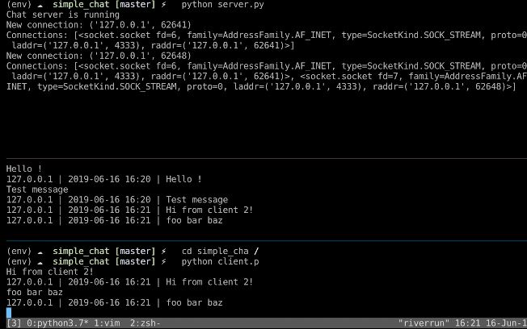

## PYChat Server

### About PYChat Server
PYChat Server is an Application server was built using Python on top of Docker, 
i interest with this method because i think i can learn more about python with docker.
    
### Getting Started
To start with this Application, Simply clone this repository by running this command below

        git clone https://github.com/ivandi1980/py_chat_server.git

or just click the green button on the top right side on this repository.

### The Folder Structure
Here is the folder Structure after you download or clone this repository
    
        |-- simple_chat
            |-- __init__.py
            |-- client.py
            |-- server.py
            |-- settings.py
        |-- .gitignore
        |-- README.md
        |-- server.py
        |-- setup.py

### Running The Application
    ....Still on Progress 

### The Screenshoot
Here is the Screenshoot of this Application

